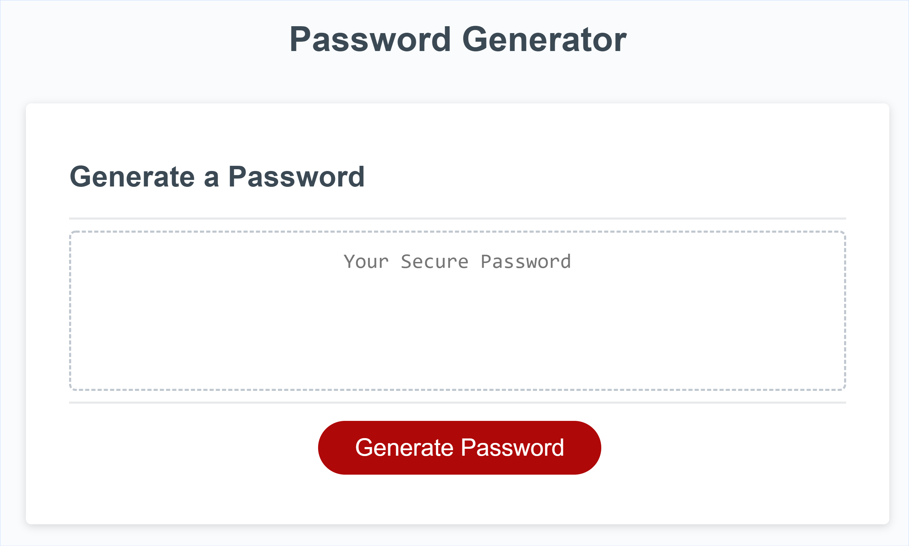
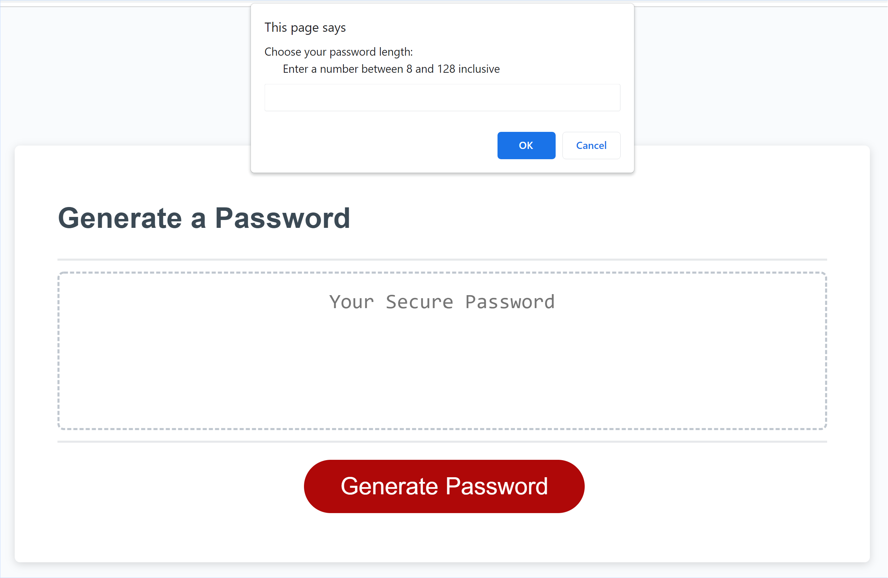
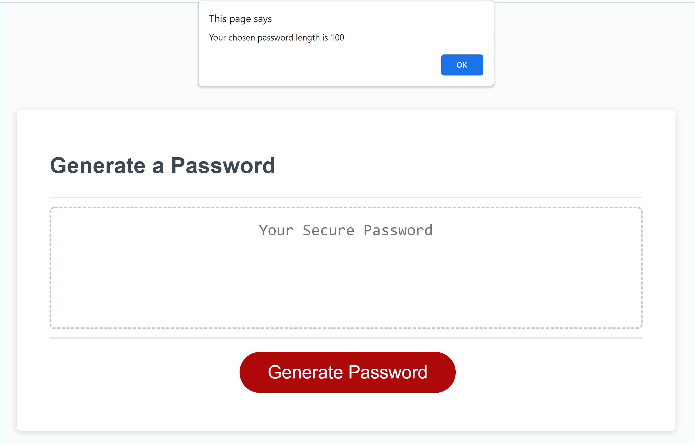
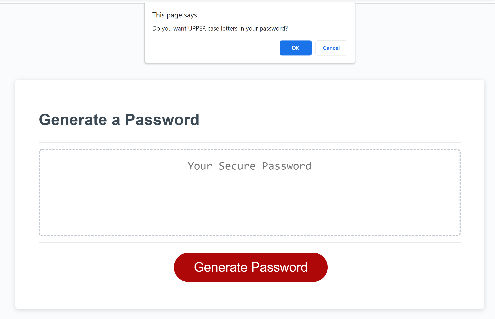
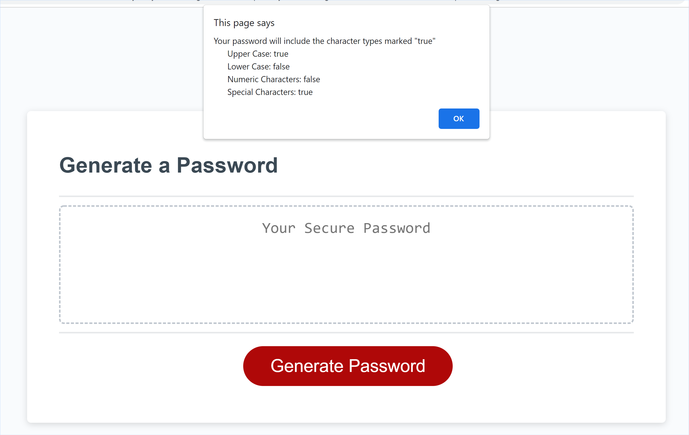
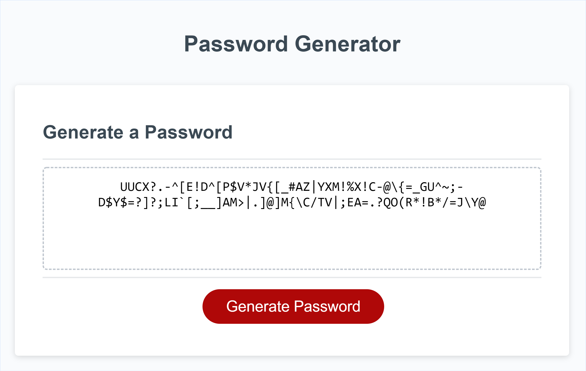

# Password Generator

## Purpose
The password generator is a tool for generating a secure password. Longer passwords created from multiple character types provide greater security and thus greater protection of sensitive data.

The password generator gives you control over password length and the character types used to create the password text.

## Usage
Use the Password Generator to generate a password by choosing
- a password length between 8 and 128 characters, and 
- one or more character types from a choice of four character types: 
  - upper case letters
  - lower case letters
  - numbers 
  - special characters

The application code is available on [GitHub](https://github.com/grace-anderson/password-generator/tree/main) 

### Instructions

#### 1. Click Generate Password
Clicking the **Generate Password** button triggers a series of prompts. 

#### 2. Choose password length
The first prompt asks you to input a password length between 8 and 128 characters. 
A prompt confirms the number you entered.

#### 3. Choose password character types
Then you are presented for a prompt for each of the four character types. 
- Select **OK** to use the character type in your password's text
- Select **Cancel** to exclude the character type from your password's text
A prompt confirms the character types you selected.

#### 4. Display password 
After you've chosen password length and the character types:
- a password will be generated using the selected character types
- the generated password will display in the read only text area of the Password Generator webpage

### 5. Use the password
Select the password text and use your local copy function (e.g. select the text then ctrl + c on Windows) to copy the text. Then paste the passwork using your local paste function (e.g. ctrl + v on Windows) where required.

## Features

The Password Generator
- Enables a user to input their preferred password length
- Provides the user a choice of four character types from which the user can use one or multiple character types
- Generates a password that 
  - consists of randomly selected characters from the user's selected character types 
  -  matches the password length inputted by the user
- Displays the generated password to the user in a form that the user can copy to use as required
- Validates the user's unput and selections so that a secure password is generated
  - password length must be inputted as a number between 8 and 128
  - at least one character type must be selected
  - generates the password when all validations are met
- Generates a password that matches the user's selected criteria
- Allows the user to repeat password generation (by clicking the "Password Generation" button without leaving the application) if they wish to create additional passwords

  
## Tests

1. When the application opens, I am presented with a page that displays without error and matches Mockup 1 (below)
2. WHen the application opens "Your Secure Password" placeholder text displays as read only in the text area (box with dashed boarder) (see Mockup 1 below)
3. When I click the **Generate Password** button, the first prompt appears requesting password length (see Mockup 2 below)
4. When I enter a number between 8 and 128 inclusive in the password length prompt, the number I entered is confirmed (see Mockup 3 below) 
5. If I do not enter a number between 8 and 128 inclusive in the password length prompt, the password length prompt input field clears so that I can enter a valid number
6. When I click OK to the password length confirmation prompt, I am presented with a series of four prompts requesting confirmation of character types (see Mockup 4 below)
7. If I click OK to the character type prompt, that character type will be included in the password AND I will be presented with the next prompt.
8. If I click Cancel to the character type prompt, that character type will not be included in the password AND I will be presented with the next prompt.
9. After I click OK or Cancel on the Special Characters prompt I am  presented with a confirmation of my charahter type selections. Selected character types are marked with "true". Non-selected character types are marked with "false". (see Mockup 5 below)
10. When I click OK to the character type confirmation prompt, a password matching my inputted password length and selected character types displays in the text area, replacing the placeholder text (see Mockup 6)
11. I can successfully copy the displayed password for use outside the application
12. While the generated password displays in the application, I can select the **Generate Password** button and complete the prompts to generate a new password. The generated password remains on the page and is replaced by the newly generated password.

## Challenges and Further Work

### Generating the password
I found collecting the user input straight forward (except for optimising user experience addressed below), but working out how to generate a password that matched the user length and chosen character types was challenging. Newbie issues happened such as return being placed inside the loop resulting in the loop executing once only or the entire password being generated with the first selected character type.

To resolve, I moved several variables outside function scope to global scope so these would be available anywhere in the application and remove the distraction of variable problems. I also moved code out of the generatePassword() function into their own functions, called by generatePassword() function, so that the purpose of each block was clear and the impact of changes could be identified. I googled for different ideas, especially around how to use the user's character type selections and then how to concatenate the final password string. This strategy enabled me to test different password generation options enclosed within a function until I could finally generate a password that meet the user's requirements. I also used console.log throughout to see what was being generated by variables as the code looped to enable trouble shooting and correction. 

### Optimising user experience
My 'newbie' abilities limited capacity to optimise user experience. I tried and failed in customising the pop-ups, especially the prompt, alert and window.confirm headings, and so have kept with the defaults as this worked.

There is an outstanding issue to resolve where the user cannot exit from the  character type choice prompts. The user is forced to complete the password generation process. Otherwise they get into a loop of prompts. This is not great user experience.

## Mock-Ups

The following imagees show the web application's appearance and functionality:

### Mock-Up 1

### Mock-Up 2

### Mock-Up 3

### Mock-Up 4

### Mock-Up 5

### Mock-Up 6

